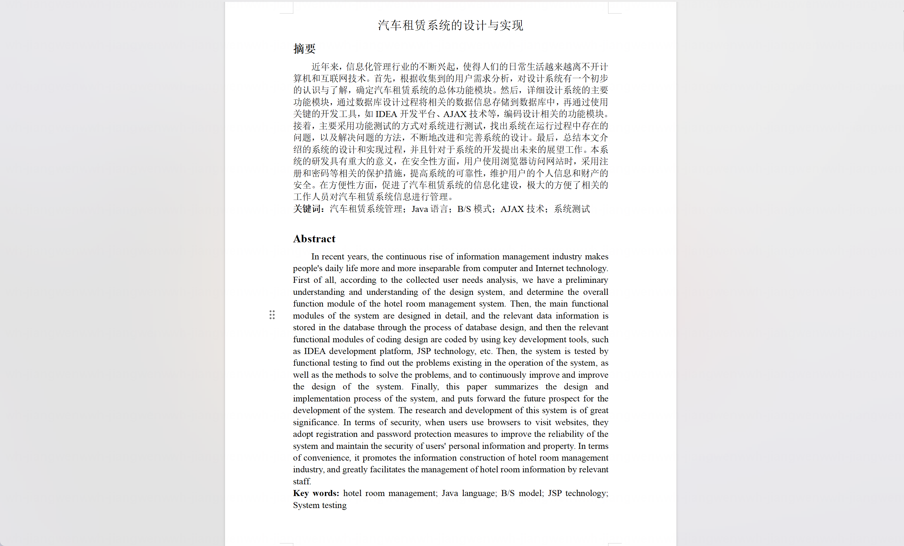
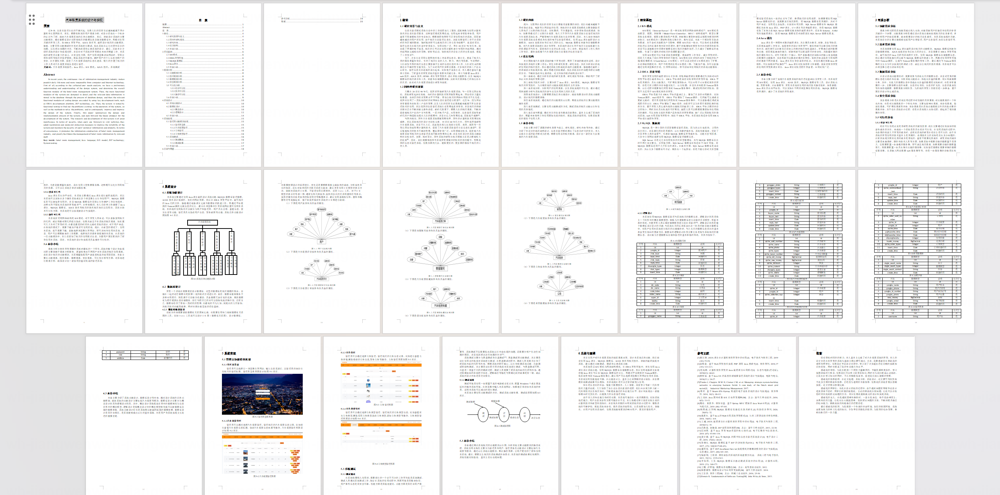
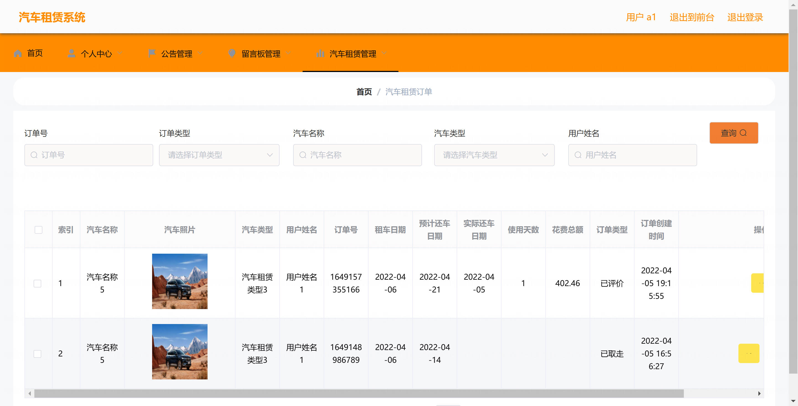
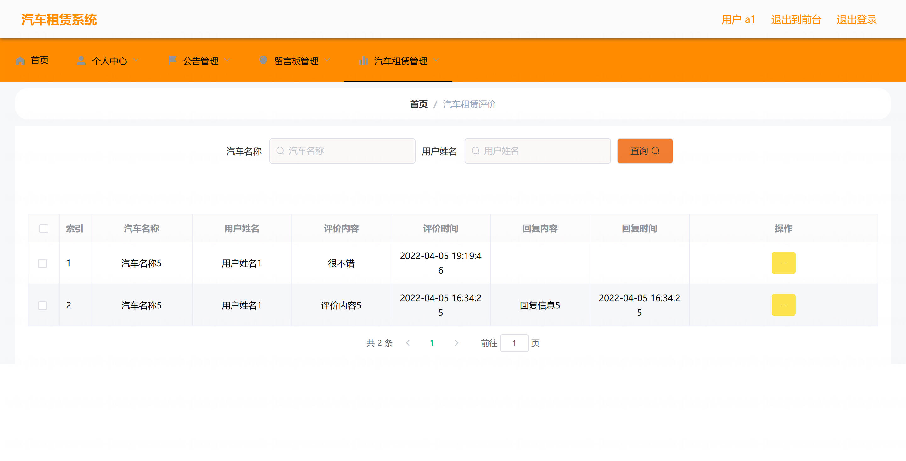
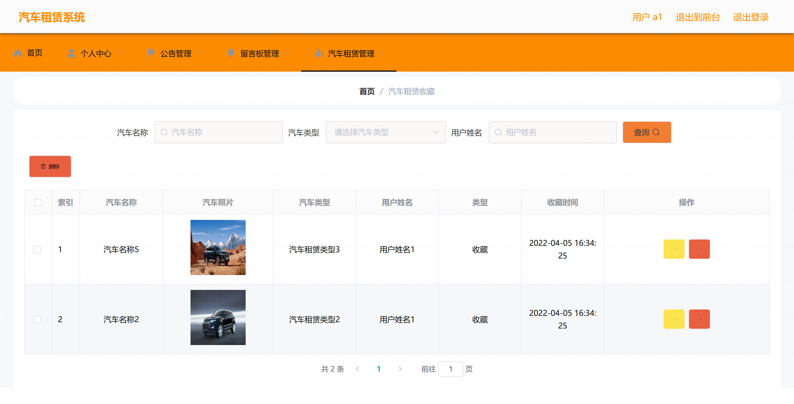
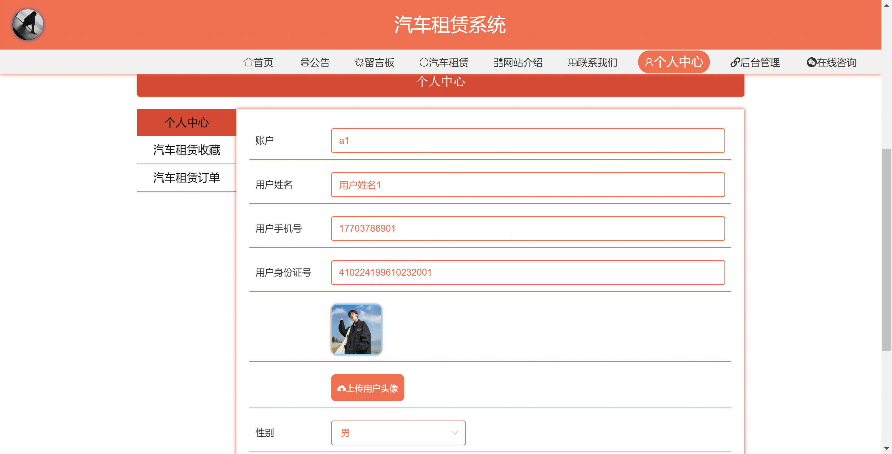
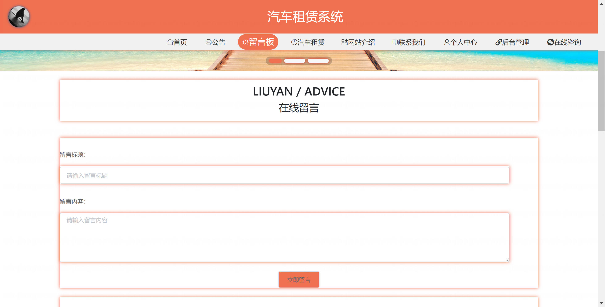
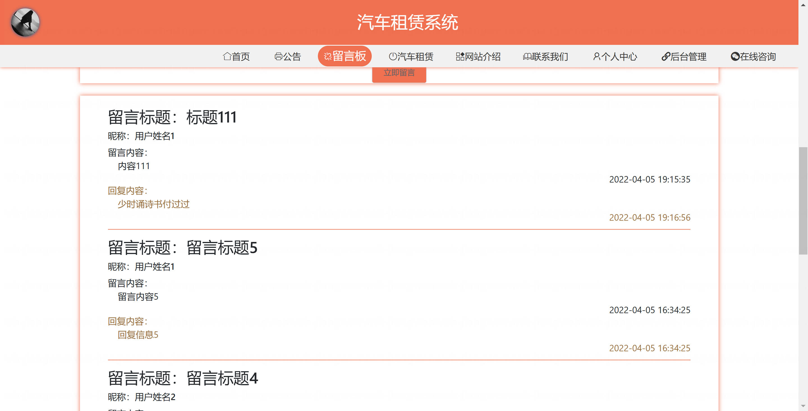
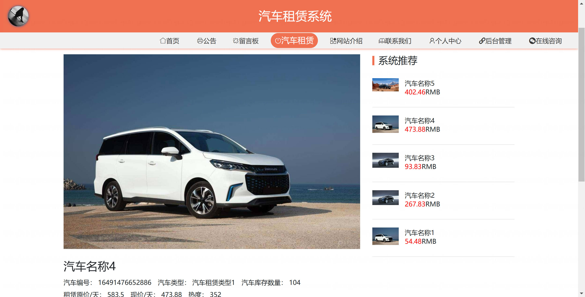
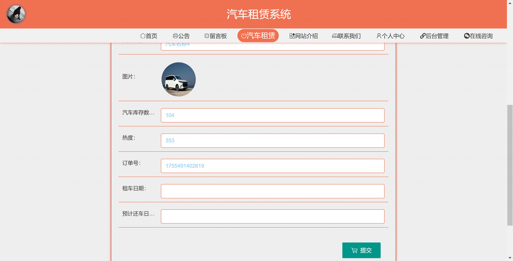

<h1 align="center">基于SpringBoot的汽车租赁系统【带论文】</h1>

- <b>完整代码获取地址：从戎源码网 ([https://armycodes.com/](https://armycodes.com/))</b>
- <b>技术探讨、资料分享，请加QQ群：692619798</b>
- <b>作者微信：19941326836  QQ：952045282</b>
- <b>承接计算机毕业设计、Java毕业设计、Python毕业设计、深度学习、机器学习</b>
- <b>选题+开题报告+任务书+程序定制+安装调试+论文+答辩ppt 一条龙服务</b>
- <b>所有选题地址 ([https://github.com/Descartes007/allProject](https://github.com/Descartes007/allProject)) </b>

## 一、项目介绍

基于SpringBoot的汽车租赁系统，系统角色主要为“管理员（后台）”和“用户（租客）”，主要功能如下：
### 管理员（后台）：
- 基本操作：登录、登出、重置密码、获取/修改个人信息
- 用户管理：查看用户列表、用户详情、新增/编辑/删除用户、重置用户密码、
- 汽车管理：查看/筛选汽车列表、汽车详情、新增/编辑/逻辑删除汽车、上/下架
- 订单管理：查看订单列表与详情、修改订单、删除订单、批量导入订单
- 评价管理：查看/回复/删除用户评价
- 收藏管理：管理用户收藏记录
### 用户（租客）：
- 基本操作：注册、登录、登出、忘记/重置密码、查看/修改个人信息
- 浏览与租赁：查看汽车列表与详情、下单租车（新增订单）、取消订单（退款逻辑）、取车、还车（自动计算费用并扣款）
- 评价与收藏：对已完成订单进行评价、收藏/取消收藏汽车
- 个人服务：查看个人订单列表/详情、查看余额并进行消费记录查看

## 二、项目技术

- 编程语言：Java（后端）
- 项目架构：B/S 架构（Spring Boot 后端 + Vue 前端）

## 三、运行环境

- JDK版本：1.8及以上都可以
- 操作系统：Windows7/10、MacOS
- 开发工具：IDEA、Ecplise、MyEclipse都可以

## 四、数据库配置文件

- npm版本：6.14.13及以上都可以
- Redis版本：3.2.100及以上都可以
- 文件名：application.yml
- 编码类型：utf8

## 论文截图

## 系统截图

